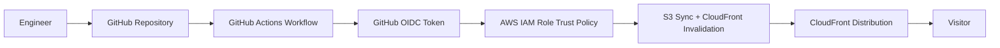
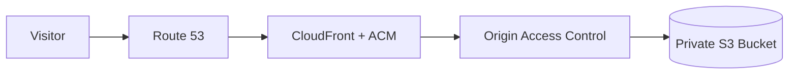

# AWS Portfolio

Cloud Security Project Portfolio built on AWS using GitHub Actions, and OIDC federation.

Live at **[cesardone.dev](https://cesardone.dev)**

## Table of Contents

- [Scenario](#scenario)
- [Architecture and Diagrams](#architecture)
- [Tech Stack](#tech-stack)
- [Pre-reqs and Setup](#pre-reqs-and-setup)
- [Lessons Learned](#lessons-learned)

## Scenario

This project demonstrates how to provision and manage a secure AWS cloud environment while avoiding long-lived cloud credentials in CI/CD.

The problem being solved:

- Provision repeatable cloud infrastructure securely.
- Enforce least-privilege access from CI pipelines.
- Improve deployment consistency and auditability for security-focused cloud engineering work.

## Architecture

### High-Level Architecture

### Request Path

The S3 bucket is never publicly reachable. CloudFront signs every origin request with SigV4 through Origin Access Control, and the bucket policy accepts reads only when `AWS:SourceArn` matches this specific distribution.

### Security Flow

1. Code is committed to GitHub.
2. GitHub Actions requests an OIDC token scoped to the `production` environment.
3. AWS IAM trust policy validates the token claims (`aud` and `sub`).
4. Workflow assumes a scoped IAM role (no static AWS keys).
5. The role can write site objects and create a CloudFront invalidation. Nothing else.

No AWS access key exists anywhere in this project. There is no key to leak, rotate, or find in a git history.

## Tech Stack

I built the website on Astro:

- Shipping zero JS on build time; minimizing attack surface
- No backend, database, auth, forms, or API routes
- One page plus a 404 page
- Plain CSS
- No third party origins at all

## Pre-reqs and Setup

### Prerequisites

- AWS account with permissions to create IAM roles/policies and target resources.
- GitHub repository with Actions enabled.
- AWS CLI configured (for local validation, if needed).
- A registered domain. Mine is registered at Porkbun with DNS delegated to Route 53.

### Setup

Everything was done through the AWS Console and CloudShell.

#### 1. S3 Bucket

I created a private S3 bucket with the following settings:

- Region: us-east-1
- Public Access: Block public access
- Bucket Encryption: SSES3
- Versioning: Enabled

S3 static hosting remains disabled. The mode requires public bucket access and only speaks HTTP. Origin Access Control keeps the bucket fully private while still serving over HHTPS.

#### 2. TLS certificate

Requested a public certificate in ACM:

- Domain name: `cesardone.dev`
- Alternative names: `www.cesardone.dev`
- Validation method: DNS

The certificate must live in `us-east-1` regardless of where the rest of the infrastructure sits, because that is the only region CloudFront reads certificates from.

Created the validation records in Route 53 from the console and waited for the status to reach `ISSUED`. These records stay in place permanently — ACM re-validates against them before every annual renewal.

#### 3. CloudFront distribution

Created a distribution with Origin Access Control:

| Setting                | Value                                      |
| ---------------------- | ------------------------------------------ |
| Origin                 | The private S3 bucket, origin access = OAC |
| Viewer protocol policy | Redirect HTTP to HTTPS                     |
| Alternate domain names | `cesardone.dev`, `www.cesardone.dev`       |
| Custom SSL certificate | The ACM certificate                        |
| Minimum TLS version    | TLSv1.2_2021                               |
| Default root object    | `index.html`                               |
| Cache policy           | `CachingOptimized`                         |

## Lessons Learned
