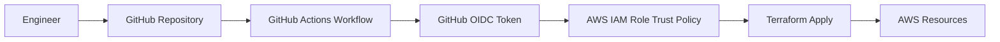

# Terraform Portfolio: Cloud Security Engineering Project

Cloud Security Project Portfolio built on AWS using Terraform, GitHub Actions, and OIDC federation.

## Table of Contents

- [Scenario](#scenario)
- [Architecture and Diagrams](#architecture)
- [Tech Stack](#tech-stack)
- [Pre-reqs and Setup](#setup)
- [Lessons Learned](#lessons-learned)

## Scenario

This project demonstrates how to provision and manage a secure AWS cloud environment using Infrastructure as Code (IaC), while avoiding long-lived cloud credentials in CI/CD.

The problem being solved:

- Provision repeatable cloud infrastructure securely.
- Enforce least-privilege access from CI pipelines.
- Improve deployment consistency and auditability for security-focused cloud engineering work.

## Architecutre and Diagrams

### High-Level Architecture

### Security Flow

1. Code is committed to GitHub.
2. GitHub Actions requests an OIDC token.
3. AWS IAM trust policy validates token claims.
4. Workflow assumes a scoped IAM role (no static AWS keys).
5. Terraform provisions/updates AWS resources with auditable role-based access.

## Pre-reqs and Setup

### Prerequisites

- AWS account with permissions to create IAM roles/policies and target resources.
- GitHub repository with Actions enabled.
- Terraform installed locally.
- AWS CLI configured (for local validation, if needed).

### Setup

## Lessons Learned
