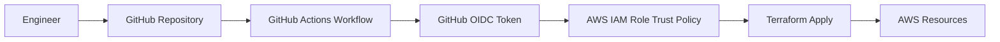

# Terraform Portfolio: Cloud Security Engineering Project

Cloud Security Project Portfolio built on AWS using Terraform, GitHub Actions, and OIDC federation.

## Table of Contents
- [Scenario - What problem am I solving?](#scenario---what-problem-am-i-solving)
- [Architecture and Diagrams](#architecture-and-diagrams)
- [Tech Stack](#tech-stack)
- [Pre-reqs and Setup](#pre-reqs-and-setup)
- [Lessons Learned](#lessons-learned)

## Scenario - What problem am I solving?

This project demonstrates how to provision and manage a secure AWS cloud environment using Infrastructure as Code (IaC), while avoiding long-lived cloud credentials in CI/CD.

The problem being solved:
- Provision repeatable cloud infrastructure securely.
- Enforce least-privilege access from CI pipelines.
- Improve deployment consistency and auditability for security-focused cloud engineering work.

## Architecture and Diagrams

### High-Level Architecture

### Security Flow
1. Code is committed to GitHub.
2. GitHub Actions requests an OIDC token.
3. AWS IAM trust policy validates token claims.
4. Workflow assumes a scoped IAM role (no static AWS keys).
5. Terraform provisions/updates AWS resources with auditable role-based access.

## Tech Stack

| Layer | Technology | Purpose |
|---|---|---|
| IaC | Terraform | Declarative provisioning of AWS infrastructure |
| Cloud | AWS | Target platform for infrastructure and security controls |
| CI/CD | GitHub Actions | Automated plan/apply workflow |
| Identity Federation | GitHub OIDC + AWS IAM | Temporary credential access from CI to AWS |
| Version Control | Git + GitHub | Change tracking, collaboration, and review |

## Pre-reqs and Setup

### Prerequisites
- AWS account with permissions to create IAM roles/policies and target resources.
- GitHub repository with Actions enabled.
- Terraform installed locally.
- AWS CLI configured (for local validation, if needed).

### Setup Steps
1. Clone the repository.
2. Configure required Terraform variables (for example via `terraform.tfvars` or environment variables).
3. Create/configure AWS IAM role for GitHub OIDC trust.
4. Configure GitHub Actions secrets/variables required by the workflow.
5. Run:
   - `terraform init`
   - `terraform plan`
   - `terraform apply`
6. Validate resources and review IAM role usage in AWS CloudTrail/CloudWatch logs.

## Lessons Learned

| What broke while building | Root cause | How I fixed it |
|---|---|---|
| GitHub Actions could not authenticate to AWS | OIDC trust policy conditions did not match repo/branch claims | Updated IAM trust policy `sub` and `aud` conditions to match GitHub token claims |
| Terraform plan/apply failed in CI | Missing provider/backend configuration and variable wiring | Added/validated provider configuration and required variables in workflow/environment |
| Permissions errors during apply | IAM role policy too restrictive for required resources | Iteratively expanded IAM permissions to least-privilege set based on failed API actions |
| Drift between local and CI behavior | Inconsistent Terraform versions/settings | Pinned Terraform version and aligned local/CI execution settings |
