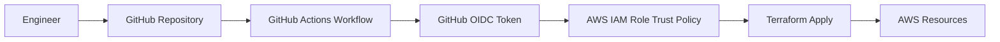

# AWS Portfolio

Cloud Security Project Portfolio built on AWS using GitHub Actions, and OIDC federation.

## Table of Contents

- [Scenario](#scenario)
- [Architecture and Diagrams](#architecture)
- [Tech Stack](#tech-stack)
- [Pre-reqs and Setup](#pre-reqs-and-setup)
- [Lessons Learned](#lessons-learned)

## Scenario

This project demonstrates how to provision and manage a secure AWS cloud environment while avoiding long-lived cloud credentials in CI/CD.

The problem being solved:

- Provision repeatable cloud infrastructure securely.
- Enforce least-privilege access from CI pipelines.
- Improve deployment consistency and auditability for security-focused cloud engineering work.

## Architecture

### High-Level Architecture

### Security Flow

1. Code is committed to GitHub.
2. GitHub Actions requests an OIDC token.
3. AWS IAM trust policy validates token claims.
4. Workflow assumes a scoped IAM role (no static AWS keys).

## Tech Stack

I built the website on Astro:

- Shipping zero JS on build time; minimizing attack surface
- No backend, database, auth, forms, or API routes
- One page plus a 404 page
- Plain CSS
- No third party origins at all

## Pre-reqs and Setup

### Prerequisites

- AWS account with permissions to create IAM roles/policies and target resources.
- GitHub repository with Actions enabled.
- AWS CLI configured (for local validation, if needed).

### Setup

On AWS, I created a private S3 bucket. I approached the set-up using the AWS console. These were the following settings:

- Region: us-east-1
- Public Access: Block public access
- Bucket Encryption: SSES3
- Versioning: Enabled

S3 static hosting remains disabled. The mode requires public bucket access and only speaks HHTp. Origin Access Control keeps the bucket fully private.

I then requested the TLS certificate:

- Domain name: cesardone.dev
- Alternative names: www.cesardone.dev
- Validation method DNS

I created records in Route 53 from the console and awaited for status update

On CloudFront, I created a distribution with Origin Access Control. On the console, i used the following settings:

- Origin: your S3 bucket, origin access = the OAC you just made
- Viewer protocol policy: Redirect HTTP to HTTPS
- Alternate domain names: example.com, www.example.com
- Custom SSL certificate: the ACM cert
- Default root object: index.html
- Cache policy: CachingOptimized
- Response headers policy: SecurityHeadersPolicy (managed, ID 67f7725c-6f97-4210-82d7-5512b31e9d03)

To further secure the site, I added a custom security policy on the response headers.

After, I attached the bucket policy to the S3 bucket giving read permissions to only the CloudFront distribution.

- Show s3GetObject policy

I used Route53 to create A and AAAA alias records for cesardone.dev and www.cesardone.dev

## Lessons Learned
